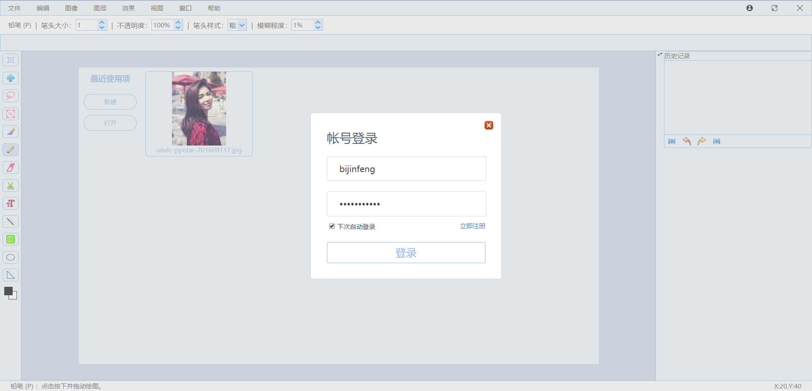
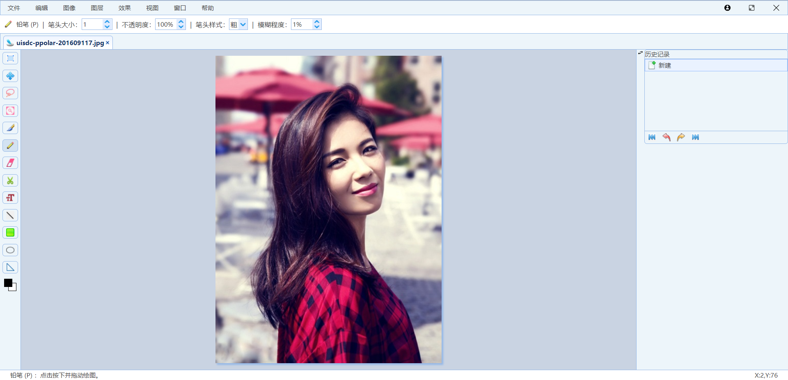
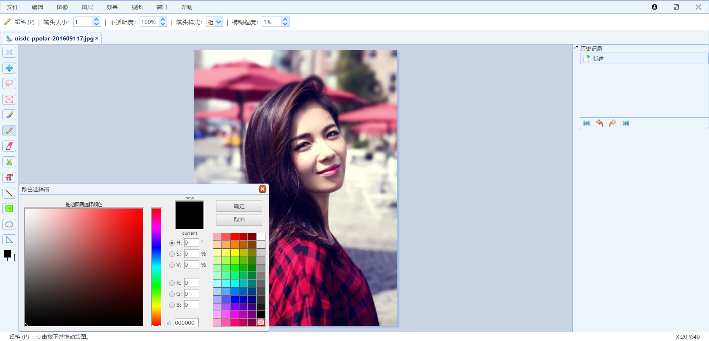

# WebPhotoshop

  

## 简介

本项目是一个基于Canvas的仿照Photoshop的在线图像处理软件，技术栈vue+express+mongoose。

## 项目特点

- [x] 基本的绘图工具
- [x] 基本的图像处理工具（色相/饱和度，亮度/对比度, 色阶，滤镜）
- [x] 曲线调整工具
- [x] 一些小工具(图片剪切、旋转，标尺，颜色选择器，操作记录等)
- [x] 基于node的静态资源服务器

## 演示地址
https://bijinfeng.github.io/WebPhotoshop/dist

## 项目截图

## 开发

#### 安装 运行 构建

    npm install

    npm run dev

    npm run build
 
### 开启服务器

    cd serve
    
    node index
